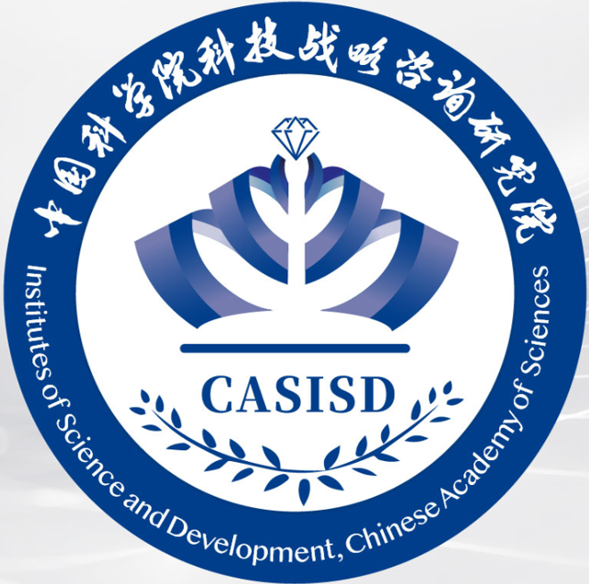

---

### 🌱 Brief Introduction

- I’m a PhD in **bioinformatics**, graduating from **<a href="https://www.pku.edu.cn/">Peking University</a>**.
- My research progects focus on [**3D Genome**](https://www.nature.com/collections/rsxlmsyslk), [**Transcription and Epigenetics**](https://www.cell.com/cell/collections/transcription-epigenetics) and [**Spatial Transcriptomics**](https://www.nature.com/articles/s41592-020-01033-y)
- You can get in touch with me by email at [**zhaowenxue@alumni.pku.edu.cn**](mailto:zhaowenxue@alumni.pku.edu.cn)

---

### 🎓 Education Background

**PhD Student** \
[**PKU**](https://www.pku.edu.cn/) • Sep.2020 - Present \
**College of Life Sciences** Bioinformatics \
 

**Bachelor Degree** \
[**SDU**](https://www.sdu.edu.cn/) • Sep.2016 - Jun.2020 \
**College of Life Sciences** Biology Science \
GPA: 90.85/100    Ranking: top 3% 

---

### 📗 Academic Experience

- **Exploring the Functions of architectural proteins on the formation and maintenance of 3D genome structure**
  - Background: Investigated the relationship between the 3D genome structure and processes such as disease and aging.
  - Responsibilities: Worked as a team collaborator to analyze multi-omics data, manage the data results and write scientific papers.
  - Achievements: A co-first author SCI paper (IF: 16.5) has published, and 2 additional papers under revision. 
- **Exploring the Impact and Mechanism of Cellular Mechanical Factors on Disease**
  - Background: Designed in vitro matrices to simulate the physiological or pathological stiffness of the liver.
  - Responsibilities: Worked as a team leader to oversee the overall planning and advancement of the research project, coordinate with doctors and advisors, and submit weekly work reports; Attended academic conferences and give presentations.
  - Achievements: The first author article of this topic is currently under review.
- **Development of multimodal technology for in situ spatial omics and mechanical atlas and its application**
  - Background: Developed multimodal experimental methods and built data analysis pipeline to reveal the spatial transcriptome and mechanical signature atlas of the tumor microenvironment.
  - Combined spatial transcriptome analysis with nanoindentation to profile the cell atlas and investigate clinical treatment target.
  - Responsibilities: Worked as a team leader to design techniques and pipelines. Coordinated the division of labor among project members and organize troubleshooting for experimental techniques.
  - Achievements: Presented at academic conferences with both a poster and an oral presentation on two occasions.

---

### 💼 Work

**Division of Data Research** \
[**Hainan Lecheng Institute of Real World Study**](https://hnrws.cn/)  Jul.2025- Present

---

### 💼 Internship

**Computational Biology Researcher Intern** \
[**BioGeometry**](https://www.biogeom.com/zh/) Jul.2023- Nov.2023
- Participated in two drug target discovery projects, cleaning and analysis of multi-omics data. Collaborated with the AI algorithm team to replicate large language models and deep learning models to identify disease targets.
- Participate in the product design department's proposal meetings, providing direction for website and software product design from a biological perspective.

**Research Assistant in the Strategic Consulting Department**	\
[**Institutes of Science and Development, Chinese Academy of Sciences**](http://www.casisd.cn/)	 Oct.2022– Jan.2023

- Conducted research and summary on the development dynamics of 32 high-tech zones, with a focus on the innovative development of the biopharmaceutical industry in high-tech zones.
- Participated in communication and interviews with KOL, drafted interview outlines, and summarized Q&A.

**Bioinformatics Intern** \
[**Illumina**](https://www.illumina.com.cn) Service & Support department  Jul.2022- Sep.2022
- Analyzed NGS datasets to support existing workflows and computational pipelines.
- Provided clear documentation of tools, workflows and analyses.
- Engaged in collaborative research with internal and external teams and department.

---

### 🏆 Honors

- **National scholarship**,  Ministry of Education of the P. R. China
- **The First Prize Scholarship and Excellent Student**, Shandong University
- **Bronze award**, International genetically engineered machine competition (iGEM)
- **Outstanding Graduates**, Shandong province
- **Honors Degrees**, Shandong University
- **Excellent Research Award**, Peking University
- **Gu Wenyu Life Sciences Scholarship**, Peking University

---

### 🌐 Skills 

**Languages and Tools**

<code></code>
<code></code>
<code></code>
<code></code>
<code></code>
<code></code>

**Design**

<code></code>
<code></code>
<code></code>

---

### Publications

  
(* Co-first author)

  
  

    Zhao, W.*, Yuan, W.*, Dong, T.*, Qi, W., Feng, Z., Li, C., et al. 
    Increased matrix stiffness promotes fibrogenesis of hepatic stellate cells through AP-1-induced chromatin priming. 
    (2025). Commun. Biol. 8, 920. 
  

  
  

    Wu, P., Hsu, A.Y., Peng, T., Zhao, W., Liu, F., Zhang, Z., et al. 
    The effect of transient, constricted migration on neutrophil intracellular bacteria-killing capability. 
    (2024). Immunity 57, 1713-1715. 
  

  
  

    Sun, Y.*, XU, X.*, Zhao, W.*, Zhang, Y., Chen, K., Li, Y., et al. 
    Rad21 is the core subunit of the cohesin complex involved in directing genome organization. 
    (2023). Genome Biol. 24, 155. 
  

  
  

    Zhang M.*, Zhao, W.*, Xiao Z.*, Chang L., Wang, X., Bai Y., et al. 
    Lamin A/C safeguards replication initiation by orchestrating chromatin accessibility and PCNA recruitment. 
    (2025). bioRxiv. 2025.03
  

  
  

    Wang, Y.*, Zhao, W.*, Niu, J., Wang, C., Li, C., Sun, Y. 
    The nucleoskeleton protein NuMA maintains local chromatin architecture partially through promoting linker histone H1 binding to chromatin and nucleosome stacking. 
    (2024). Submitted.
  

  
  

    Niu, J.*, Wang, X.*, Zhao, W.*, Wang, Y., Qin, Y., Huang, X., et al. 
    Perinuclear force regulates SUN2 dynamics and distribution on the nuclear envelope for proper nuclear mechanotransduction. 
    (2024). Submitted.
  

  
  

---

[**Download my CV**](src="./250629_CV_Zhao_Wenxue_github.pdf") to learn me more!

last update Jul.2025
